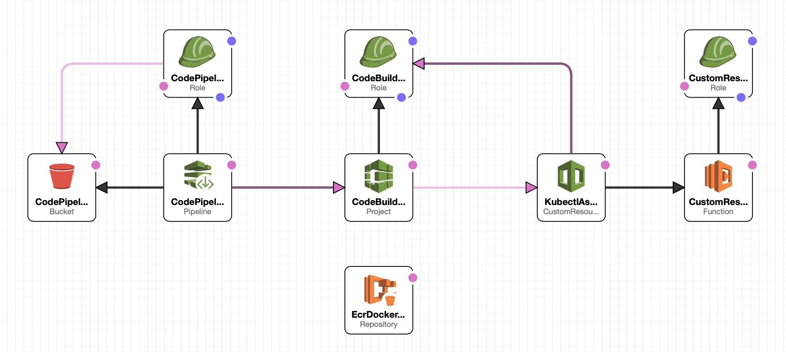

# eks-cicd-template



This repository contains a template to containerize and deploy a Flask API 
to a Kubernetes cluster using Docker, AWS EKS, CodePipeline, and CodeBuild.

This project has been done as the final step of the CICD Module 
of Udacity's Full Stack Web Developer Nanodegree.

## Application description
The Flask application that has been used has three endpoints:
- `GET '/'`: A health check, which returns the response 'Healthy'. 
- `POST '/auth'`: It takes email and password as json arguments. It returns a JWT based on a custom secret.
- `GET '/contents'`: This requires a valid JWT. It returns the decrypted contents of that token. 
The app relies on a secret set as the environment variable `JWT_SECRET` to produce a JWT. 

## Development Setup
To execute the code locally:
Add the current project folder path to PYTHONPATH.  
In ~/.bashrc, append:
```
PYTHONPATH=your/path/to/repo:$PYTHONPATH 
export PYTHONPATH
```
e.g.
```
PYTHONPATH=~/PycharmProjects/eks-cicd-template:$PYTHONPATH 
export PYTHONPATH
```

To install and activate the environment:
```
conda create --name eks-cicd-template python=3.7
pip install -r requirements.txt
```

To run the Flask server locally:
```
export JWT_SECRET=MySecretCode
export FLASK_APP=src/flask/main.py
flask run --port=80 --host='0.0.0.0'
```

Check that the request is computed without errors:
```
token=`curl -d '{"email":"'wolf@thedoor.com'","password":"huff-puff"}' -h "content-type: application/json" -X POST 0.0.0.0:80/auth  | jq -r '.token'`
curl --request get '0.0.0.0:80/contents' -h "authorization: bearer ${token}" | jq 
```

##Tests
To run the unittests, run:
```
python -m unittest discover tests
```

## Other Dependencies
- Github Account
- AWS Account
- Docker Engine
     
## Documentation:
[1. Docker: how to containerise a flask API](./docs/1-docker.md)  
[2. EKS: how to create a Kubernetes cluster](./docs/2-eks.md)  
[3. CloudFormation: how to create a stack of resources to trigger a cicd pipeline](./docs/3-stack.md)  
[4. CodeBuild: how to build and deploy a Docker Image](./docs/4-deploy.md)  
[5. ShutdownOperations: how to delete the Cluster, the Stack of resources and the sensitive parameters](./docs/5-shutdown.md)  

